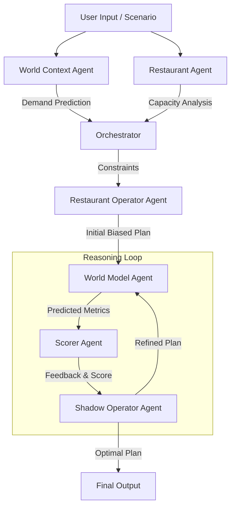

# QSR World Model: A "Noob Operator" Playground 
### Learning to Simulate Restaurant Operations Before They Happen
A weekend exploration of world models and agentic AI applied to staffing decisions. This is built crudely but meaningfully enough to learn as I don't have prior experience with QSR domain. 

##  Objective: 
Demonstrate AI product development skills. i.e Take academic AI concepts → Design working system → Ship functional prototype → Document learnings.

## What This Is
Built to understand how world models (Ha & Schmidhuber 2018) apply to business operations using modern AI tools to accelerate development.

### Ambition of this project:  
The core ambition of this project is to explore the concept of a **World Model** using LLM agents with reasoning instead of deep reinforcement learning or vision intelligence models. Though this concept is applied for robotics or video games or coding, I like to explore it for the high pressure environment of Quick Service Restaurant (QSR) operations.

### Outcomes: 
 "Predict what staffing decision achieves not just costs but also customer satisfaction, staff well-being".

### Classic World Model Loop
Real-time execution loop:
Observe → Encode (V) → Predict (M) → Act (C) → Observe...
         ↑                                          ↓
         └────────── Continuous Feedback ───────────┘

### QSR World Model Loop

Operator Flow:
Scenario → Encode (World Context) → Simulate (World Model) → Real World Operator Priority → Operator Staffing Decision 

Simulation Flow:
Scenario → Encode (World Context) → Simulate (World Model) → Shadow Operator Simulation Loops

  Simulation Loop:
  Shadow Operator Staffing Decision → Score each staffing decision (against multi-objective for alignment) → Select Best Fit 
  
Operator Feedback Loop:
Compare Against Operator Decision for short term learning

System Learning Loop:
Compare Against Real World Results for long term learning

### Approach Comparison
Observing + Understanding world context →  LLM based processing replaces VAE in the world model
Simulating outcomes         →  Agentic reasoning i.e Chain-of-thought replaces large RNN in the world model
Optimizing decisions        →  Multi LLM based agent work together and optimize against multi-objective for alignment replaces large RL in the world model
Incorporating Real World Results → → Explicit reasoning replaces gradients in the world model

```mermaid
graph TB
    subgraph Theory["🎓 CLASSIC WORLD MODEL (Ha & Schmidhuber 2018)"]
        V[V - Vision/VAE<br/>Compress pixels → z<br/>Visual feature extraction]
        M[M - Memory/RNN<br/>Predict p(z_t+1 | z_t, a_t, h_t)<br/>Learned dynamics model]
        C[C - Controller<br/>Policy π(a_t | z_t, h_t)<br/>Trained action selection]
        R[Loss/Reward<br/>Prediction error<br/>Training signal]
        
        V -->|Latent state z_t| M
        M -->|Predicted z_t+1| C
        C -->|Action a_t| ENV[Environment]
        ENV -->|Observation| V
        ENV -->|Reward| R
        R -.->|Gradients| V
        R -.->|Gradients| M
        R -.->|Gradients| C
    end
    
    subgraph Implementation["💻 MY QSR IMPLEMENTATION"]
        V2[World Context Agent<br/>+ Restaurant Model<br/>━━━━━━━━━━━━━━<br/>Scenario → JSON context<br/>Natural language encoding]
        M2[World Model Simulator<br/>━━━━━━━━━━━━━━<br/>Simulates shift outcomes<br/>Reasoning-based forward model]
        C2[Decision Maker<br/>+ Scorer Agents<br/>━━━━━━━━━━━━━━<br/>Propose → Evaluate → Select<br/>Multi-agent deliberation]
        R2[Evaluator Agent<br/>━━━━━━━━━━━━━━<br/>Compare predicted vs actual<br/>Error analysis + parameter updates]
        
        V2 -->|Structured state| M2
        M2 -->|Predicted metrics| C2
        C2 -->|Staffing decision| REAL[Real Operations]
        REAL -->|Actual results| R2
        R2 -.->|Model improvements| V2
        R2 -.->|Model improvements| M2
    end
    
    %% Mapping arrows
    V -.->|Maps to| V2
    M -.->|Maps to| M2
    C -.->|Maps to| C2
    R -.->|Maps to| R2
    
    %% Styling
    style V fill:#e1f5ff,stroke:#0066cc,stroke-width:2px
    style M fill:#ffe1f5,stroke:#cc0066,stroke-width:2px
    style C fill:#e1ffe1,stroke:#009900,stroke-width:2px
    style R fill:#fff4e1,stroke:#ff9900,stroke-width:2px
    
    style V2 fill:#e1f5ff,stroke:#0066cc,stroke-width:3px
    style M2 fill:#ffe1f5,stroke:#cc0066,stroke-width:3px
    style C2 fill:#e1ffe1,stroke:#009900,stroke-width:3px
    style R2 fill:#fff4e1,stroke:#ff9900,stroke-width:3px
    
    style ENV fill:#ffcccc,stroke:#cc0000,stroke-width:2px
    style REAL fill:#ffcccc,stroke:#cc0000,stroke-width:2px
```

### Development cycle:
Step 1: Research world models + agentic AI → Architecture design
Step 2: Implement few agents + orchestration + evals → Backend  
Step 3: Build UX + integration + Test Harness → Working prototype  
Step 4: Iterate on feedback → Polishing + Documentation

### Built with:
Google Gemini 3.0 Flash (reasoning)
AntiGravity (IDE)
Figma (rapid UI prototyping)
FastAPI + React + TypeScript (production-quality stack)
Prep: Google ADK + FunctionGemma (not included here)


## Problem Identification
Key assumption and simplification is that QSR managers make a important staffing decision with intuition and limited information rather than simulation

### Gap Addressed / Gap Assumed
* Existing tools predict demand but does not offer way to see the consequences before decisions are made 
* Trade-offs between customer delight, staff well-being and profit are implicit, not explicit

### Key Questions Explored:
* Can we simulate operational outcomes before execution?
* How does the concept of a world model apply to restaurant operations?
* How can AI agents coordinate to solve complex problems?
* What does multi-objective optimization look like in practice?

## Academic Inspiration:
* Ha & Schmidhuber's World Models (2018)
   → Learn compressed representations of environments
   → Simulate future states from current state + action
   → Plan by imagining consequences
* Dr Fei Fei Li's World Models: https://www.worldlabs.ai/
* Meta's Code World Models 
   → "Predict what code does, not just what it looks like"
* Agentic AI (LLM) Architectures
   → Agent specialization and coordination
   → Reasoning through chain-of-thought
   → Learning from outcomes

## Key Questions I Explored:
* Can we simulate operational outcomes before execution?
* How does the concept of a world model apply to restaurant operations?
* How can AI agents coordinate to solve complex problems?
* What does multi-objective optimization look like in practice?


## What is a world model:
By using features extracted from the world model as inputs to an AI agent, one can train a simple function or a policy that can solve the required task. One can even train agent entirely using LLMs as stop gap measure and transfer this decision back into the actual environment.

A World Model aims to simulate the future in order to predict consequences of actions before taking them. It relies on:
1.  **Representation Learning:** Understanding the current state of the environment in deeper ways
2.  **Planning & Reasoning:** Simulating "what if" scenarios to help make future actions and optimize outcomes.

This project is a **crude, agentic approximation** of that concept. Instead of deep reinforcement learning, I have leveraged **Chain-of-Thought (CoT) reasoning** and Large Language Models (LLMs) to construct a crude mental model of a restaurant shift. I want to see if a system of agents can "think" through a staffing plan, simulate a Friday dinner rush and refine its decisions.

## 🧪 The Experiment: Flaws
This is as much a learning tool for me as it is a software prototype. The domain of QSR operations is much more nuanced than my assumptions. There are inherent flaws in my own understanding of the problem space and the agents themselves are "noob operators"—subject to hallucinations, bad assumptions, and limited context.

### The central loop:**
1.  **Propose:** An operator agent proposes a staffing plan based on a specific "Operator Priority" or "Primary Goal" (e.g., minimizing costs).
2.  **Simulate:** A system of "World Model" agents plays out that shift, predicting wait times, revenue, bottlenecks and staff satisfaction.
3.  **Score:** A "Scorer" agent evaluates the outcome against multi-objective targets (Profit vs. Customer Satisfaction vs. Staff Wellbeing).
4.  **Learn:** A "Shadow Operator" (the rational planner) iterates on the plan to find a global optimum that a biased human might miss. This rational planning is indepenet of the operator proposed plan. 


### The Agentic World Model Loop

The system operates as a coordinated dance of specialized agents, mirroring the thought process of a management team:



### Core Agents
1.  **Restaurant Operator Agent (The Manager):** "What are my staffing options?" Generates strategic plans based on priorities.
2.  **World Model Agent (The Simulator):** "What will happen if we do this?" Simulates the shift and predicts metrics.
3.  **Scorer Agent (The Critic):** "How good is this option?" Scores outcomes against targets.
4.  **Shadow Operator Agent (The Optimizer):** "Can we do better?" Iteratively refines the plan based on feedback.
5.  **Evaluator Agent (The Teacher):** "What did we learn?" Compares predictions vs actuals (post-execution).
6.  **World Context Agent:** Analyzes external factors (weather, events).
7.  **Restaurant Agent:** Analyzes internal constraints (kitchen capacity).

## 🧠 Approach & Architecture

### Multi-Objective Optimization
The tension between three competing goals is modeled using configurable weights to balance them:
1.  **Profit Target Score:** Efficiency and labor cost management (Lower is better).
2.  **Guest Satisfaction Target Score:** Speed of service and order accuracy (Lower wait time is better).
3.  **Staff Wellbeing Target Score:** Preventing burnout and under-utilization (Target is a specific range, e.g., 70-85%).

## 🔑 Key Features

### Functional
*   **Multi-Agent Orchestra:** 6+ specialized agents working in concert.
*   **Iterative Refinement:** The system doesn't just give an answer; it "thinks" and improves its answer over multiple steps.
*   **Bias Modeling:** Simulate shifts from different perspectives (e.g., "Customer First" vs. "Minimize Cost").
*   **Different Scenarios:** Take into consideration weather, special events (post-game rush), and day-part variations.
*   **Transparency:** Full visibility into the "Inner Reasoning Monologue" of every agent via the UI.

## 🧪 Evaluations

This project includes a dedicated evaluation harness in the backend to "grade" the agents against known scenarios.

**Ground Truth Validation:**
The `Evaluator Agent` and `qsr_eval.sh` script compare agent outputs against expected baselines to ensure:
1.  **Reasoning Quality:** Does the agent's logic make sense?
2.  **Priority Alignment:** Did the agent actually follow the "Minimize Cost" or "Customer First" instruction?
3.  **Simulation Accuracy:** Are the predicted metrics (wait times, revenue) within realistic bounds?

**Running Evals:**
```bash
cd be/qsr-be
./qsr_eval.sh agent=operator
```
*Outputs a detailed JSON report with Pass/Fail rates and alignment scores.*


## 🚧 Known Issues & Learning Gaps

**Conceptual Limitations:**
-   **Not a true world model:** Uses LLM reasoning as an approximation, not learned neural dynamics.
-   **Limited causality:** Relies on correlational patterns in the LLM's training data, not deep causal understanding of physics or logistics.

**Implementation Gaps:**
-   **No persistent state:** Learning doesn't persist between sessions yet.
-   **Manual data entry:** No automated integrations with POS systems.
-   **Simplified simulation:** Does not yet account for equipment failures, shift overlaps, or individual staff skill levels.

**Domain Knowledge Gaps:**
-   Admittedly, I'm not a QSR expert. The model likely oversimplifies staffing complexity (breaks, training) and non-linear demand patterns.
-   **But that's the point**—this is a learning exercise to see how far agentic reasoning can go.


## 📂 Project Structure

This playground consists of two main components. Please refer to their respective READMEs for setup instructions:

*   **[Backend (Python/FastAPI)](./be/qsr-be/README.md):** The brain of the operation. Hosts the agents, the orchestration logic, and the simulation engine.
*   **[Frontend (React/Vite)](./fe/qsr-fe/README.md):** The visual workspace. Provides a "canvas" for users to tweak scenarios, run the model, and visualize the iterative reasoning process.

---
*Built with curiosity over a weekend. Learning in progress. 