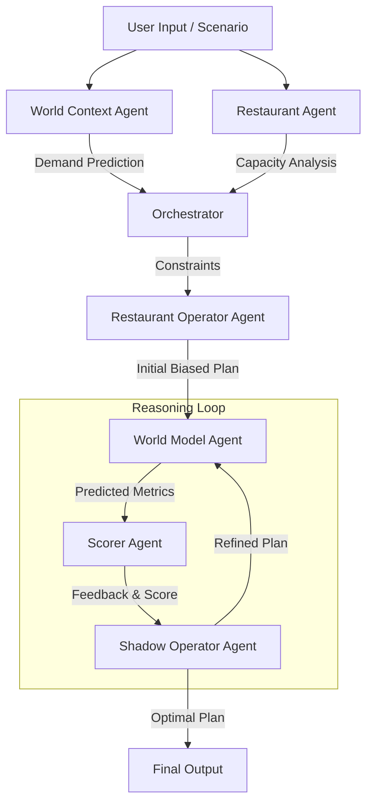

# QSR World Model: A "Noob Operator" Playground 🍔🤖

> **Status:** Prototype / Experimental  
> **Velocity:** Built in ~2-3 days over a holiday weekend

## 🎯 Objective: Why This Matters

The core ambition of this project is to explore the concept of a **World Model**—not for robotics or video games or code (where it is typically applied) but for the messy, high-pressure environment of Quick Service Restaurant (QSR) operations.

In AI research, a World Model aims to simulate the future in order to predict consequences of actions before taking them. It relies on:
1.  **Representation Learning:** Understanding the current state.
2.  **Planning & Reasoning:** Simulating "what if" scenarios to optimize decisions.

This project is a **crude, agentic approximation** of that concept. Instead of deep reinforcement learning, we leverage **Chain-of-Thought (CoT) reasoning** and Large Language Models (LLMs) to construct a mental model of a restaurant shift. We want to see if a system of agents can "think" through a staffing plan, simulate the chaos of a Friday dinner rush and refine its decisions just like a seasoned manager would—but in minutes, not hours.

## 🧪 The Experiment: Learning Loops & Flaws

This is as much a learning tool for the author as it is a software prototype. The domain of QSR operations is incredibly nuanced. There are inherent flaws in my own understanding of the problem space and the agents themselves are "noob operators"—subject to hallucinations, bad assumptions, and limited context.

**The central loop we are exploring is:**
1.  **Propose:** An operator agent proposes a staffing plan based on a specific "Operator Priority" (e.g., minimizing costs).
2.  **Simulate:** A separate "World Model" agent plays out that shift, predicting wait times, revenue and bottlenecks.
3.  **Critique:** A "Scorer" agent evaluates the outcome against multi-objective targets (Profit vs. Satisfaction vs. Wellbeing).
4.  **Refine:** A "Shadow Operator" (the rational planner) iterates on the plan to find a global optimum that a biased human might miss.

## 🧠 Approach & Architecture

### Multi-Objective Optimization

We model the tension between three competing goals, using configurable weights to balance them:

1.  **Profit Target Score:** Efficiency and labor cost management (Lower is better).
2.  **Guest Satisfaction Target Score:** Speed of service and order accuracy (Lower wait time is better).
3.  **Staff Wellbeing Target Score:** Preventing burnout and under-utilization (Target is a specific range, e.g., 70-85%).

The system attempts to maximize the combined score:
```python
# Conceptual Formula
overall_score = (
    profit_score * 0.40 +
    customer_score * 0.35 +
    staff_score * 0.25
)
```

### The Agentic World Model Loop

The system operates as a coordinated dance of specialized agents, mirroring the thought process of a management team:



### Core Agents
1.  **Restaurant Operator Agent (The Manager):** "What are my staffing options?" Generates strategic plans based on priorities.
2.  **World Model Agent (The Simulator):** "What will happen if we do this?" Simulates the shift and predicts metrics.
3.  **Scorer Agent (The Critic):** "How good is this option?" Scores outcomes against targets.
4.  **Shadow Operator Agent (The Optimizer):** "Can we do better?" Iteratively refines the plan based on feedback.
5.  **Evaluator Agent (The Teacher):** "What did we learn?" Compares predictions vs actuals (post-execution).
6.  **World Context Agent:** Analyzes external factors (weather, events).
7.  **Restaurant Agent:** Analyzes internal constraints (kitchen capacity).

## 🔑 Key Features

### Functional
*   **Multi-Agent Orchestra:** 7+ specialized agents working in concert.
*   **Iterative Refinement:** The system doesn't just give an answer; it "thinks" and improves its answer over multiple steps.
*   **Bias Modeling:** Simulate shifts from different perspectives (e.g., "Customer First" vs. "Minimize Cost").
*   **Rich Scenarios:** Handles weather, special events (post-game rush), and day-part variations.
*   **Transparency:** Full visibility into the "Inner Monologue" of every agent via the UI.

### Technical
*   **Agentic Framework:** Built on Google Gemini with custom prompt engineering for structured reasoning.
*   **Dynamic Discovery:** Frontend automatically scans and connects to available backends.
*   **Evaluation Engine:** Dedicated CLI tools to "grade" the agents against known ground-truth scenarios.

---

## 🚧 Known Issues & Learning Gaps

**Conceptual Limitations:**
-   **Not a true world model:** Uses LLM reasoning as an approximation, not learned neural dynamics.
-   **Limited causality:** Relies on correlational patterns in the LLM's training data, not deep causal understanding of physics or logistics.

**Implementation Gaps:**
-   **No persistent state:** Learning doesn't persist between sessions yet.
-   **Manual data entry:** No automated integrations with POS systems.
-   **Simplified simulation:** Does not yet account for equipment failures, shift overlaps, or individual staff skill levels.

**Domain Knowledge Gaps:**
-   Admittedly, I'm not a QSR expert. The model likely oversimplifies staffing complexity (breaks, training) and non-linear demand patterns.
-   **But that's the point**—this is a learning exercise to see how far agentic reasoning can go.

## ⏱️ Development Timeline

**Total:** ~20-24 hours over holiday weekend (Dec 28-30, 2024)

-   **Day 1 (8h):** Concept, architecture, schema design.
-   **Day 2 (10h):** Backend implementation, agent orchestration, API.
-   **Day 3 (6h):** Frontend, integration, polish, documentation.

**Underestimated:** Agent prompt engineering, JSON parsing reliability.
**Worked well:** Pydantic validation, FastAPI, modular agent design.

## 📖 References

**Academic Inspiration:**
-   Ha & Schmidhuber (2018): "World Models"
-   Meta AI (2024): "Code World Models"
-   Hafner et al. (2019): "Dream to Control"

## 📂 Project Structure

This playground consists of two main components. Please refer to their respective READMEs for setup instructions:

*   **[Backend (Python/FastAPI)](./be/qsr-be/README.md):** The brain of the operation. Hosts the agents, the orchestration logic, and the simulation engine.
*   **[Frontend (React/Vite)](./fe/qsr-fe/README.md):** The visual workspace. Provides a "canvas" for users to tweak scenarios, run the model, and visualize the iterative reasoning process.

---
*Built with curiosity over a weekend. Learning in progress. 🚀*
