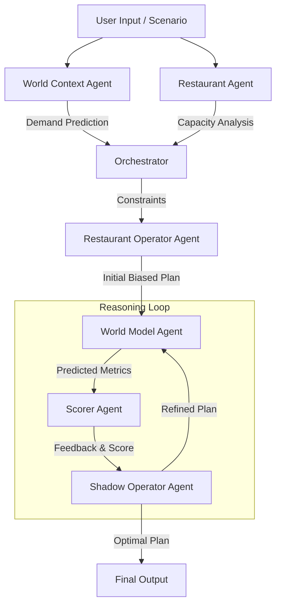
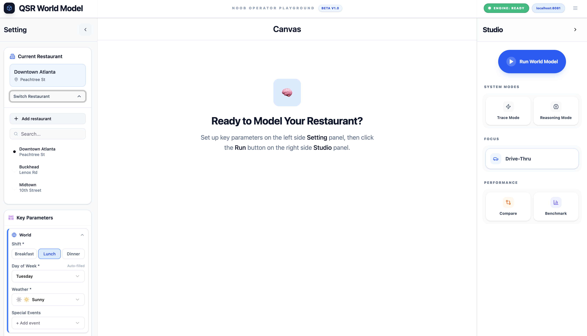
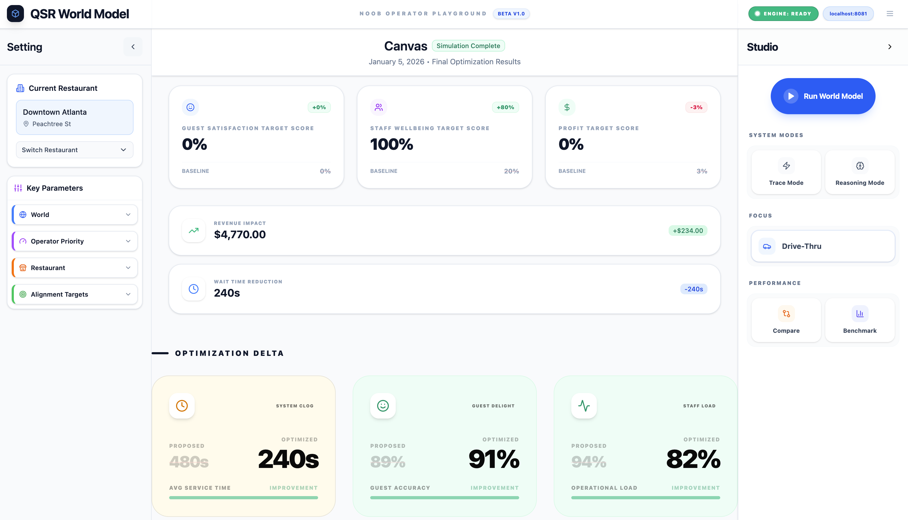
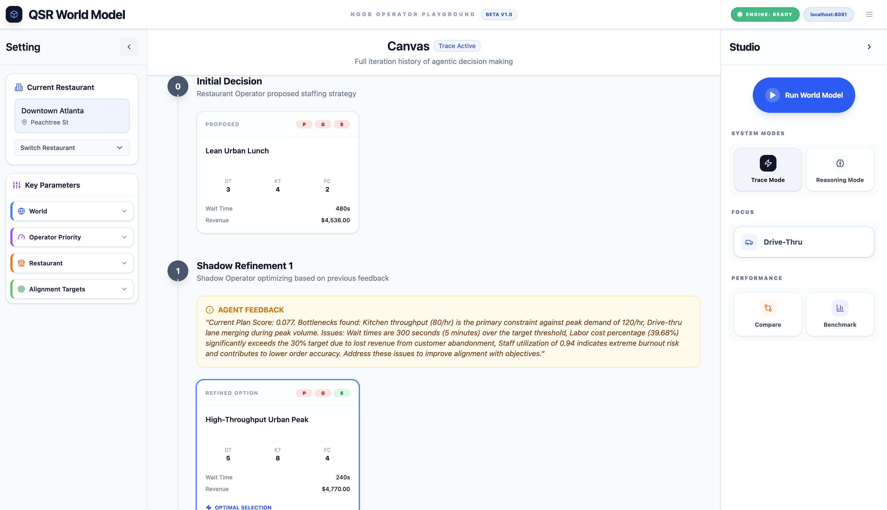
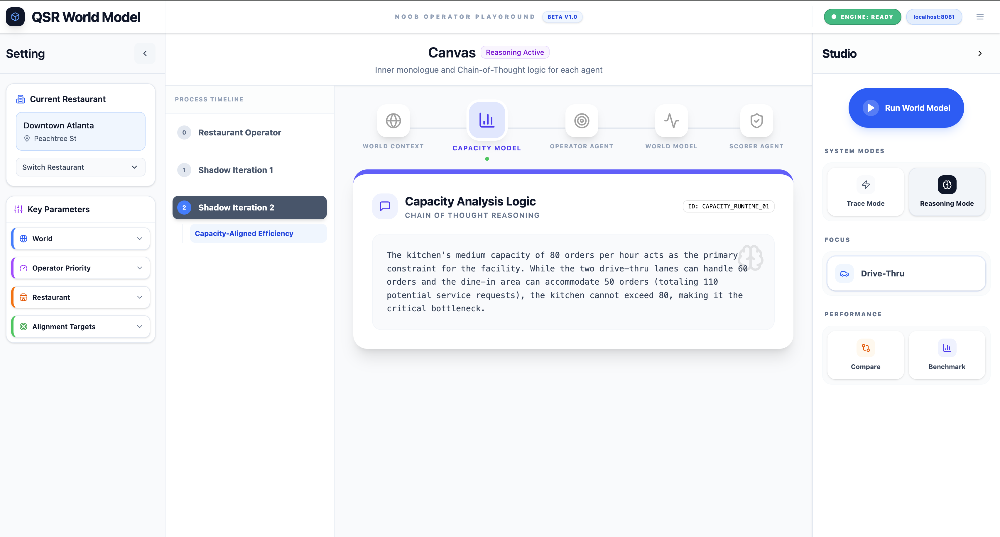

# QSR World Model: A "Noob Operator" Playground 
### Learning to Simulate Restaurant Operator Decision such as Staff Plan
A weekend exploration of world models and agentic AI applied to staffing decisions. This is built crudely but meaningfully enough to learn as I don't have prior experience with QSR domain. 

##  Objective: 
Demonstrate AI product development skills. i.e Take academic AI concepts → Design working system → Ship functional prototype → Document learnings.

## What This Is
Built to understand how world models (Ha & Schmidhuber 2018) apply to business operations using modern AI tools to accelerate development.

### Aim of this project:  
The core ambition of this project is to explore the concept of a **World Model** using LLM agents with reasoning instead of deep reinforcement learning or vision intelligence models. Though this concept is applied for robotics or video games or coding, I like to explore it for the high pressure environment of Quick Service Restaurant (QSR) operations.

### Key Questions Explored:
* Can we simulate operational outcomes before execution?
* How does the concept of a world model apply to restaurant operations?
* How can AI agents coordinate to solve complex problems?
* What does multi-objective optimization look like in practice?

### Outcomes: 
 "Predict what staffing decision achieves, not just costs but also customer satisfaction, staff well-being".

## World Model Comparison
### Classic World Model Loop
Real-time execution loop:
Observe → Encode (V) → Predict (M) → Act (C) → Observe...
         ↑                                          ↓
         └────────── Continuous Feedback ───────────┘

### QSR World Model Loop

#### Operator Flow (Huaman decision):
Scenario → Encode (World Context) → Simulate World Model (Demand) → Operator Priority → Operator Staffing Decision 

#### Shadow Operator Loop (LLM based scoring & optimization):
Same Scenario → Encode (World Context) → Simulate World Model (Demand) → Optimization Loop (scoring) → Shadow Operator Staffing Decision (best fit) 

### The Agentic World Model Loop 



### Inspiration:
* Ha & Schmidhuber's World Models (2018)
   → Learn compressed representations of environments
   → Simulate future states from current state + action
   → Plan by imagining consequences
* Dr Fei Fei Li's World Models: https://www.worldlabs.ai/
* Meta's Code World Models 
   → "Predict what code does, not just what it looks like"


## Quick Start

### Configure Your Restaurant & Key Parameters using the left panel

📍 Current Restaurant -> Downtown Atlanta, Peachtree St

🌍 World Context -> Weather, day, special events

🎯 Operator Priority -> Select your optimization focus

🍔 Restaurant Context -> Capacity

🎚️ Alignment Targets -> Max Labor Cost: 30%, Max Wait Time: 180s, Target Utilization: 0.82

#### Example input screenshot


### Run the World Model using the right panel

🎯 Click "Run World Model" button and wait ;-) 

#### Example run time screenshot


### Fiddle with Trace and Reason Modes  

🎯 Click "Trace and Reason" mode after successful completion of "Run World Model" 

#### Example trace  screenshots


#### Example reasoning screenshots


## Implementation Introduction

### Problem Identification
Key assumption and simplification is that QSR managers make a important staffing decision with intuition and limited information rather than simulation

### Gap Addressed / Gap Assumed
* Existing tools predict demand but does not offer way to see the consequences before decisions are made 
* Trade-offs between customer delight, staff well-being and profit are implicit, not explicit

### The Experiment: Flaws & Caveats
This project as much a learning exercise for me. The domain of QSR operations is much more nuanced and complex than my assumptions. There are inherent flaws in my own understanding of the problem space and the agents themselves are "noob operators" subject to hallucinations and limited capacity of the out of the box model.


### Core Agents
1.  **Restaurant Operator Agent (The Manager):** "What are my staffing options?" Generates strategic plans based on priorities.
2.  **World Model Agent (The Simulator):** "What will happen if we do this?" Simulates the shift and predicts metrics.
3.  **Scorer Agent (The Critic):** "How good is this option?" Scores outcomes against targets.
4.  **Shadow Operator Agent (The Optimizer):** "Can we do better?" Iteratively refines the plan based on feedback.
5.  **Evaluator Agent (The Teacher):** "What did we learn?" Compares predictions vs actuals (post-execution).
6.  **World Context Agent:** Analyzes external factors (weather, events).
7.  **Restaurant Agent:** Analyzes internal constraints (kitchen capacity).

##  Approach & Architecture

### Multi-Objective Optimization
The tension between three competing goals is modeled using configurable weights to balance them:
1.  **Profit Target Score:** Efficiency and labor cost management (Lower is better).
2.  **Guest Satisfaction Target Score:** Speed of service and order accuracy (Lower wait time is better).
3.  **Staff Wellbeing Target Score:** Preventing burnout and under-utilization (Target is a specific range, e.g., 70-85%).

### Functional
*   **Different Scenarios:** Take into consideration weather, special events and local variations.
*   **Multi-Agent Orchestration:** 6+ specialized agents working in concert.
*   **Iterative Refinement with reward function:** The system doesn't just give an answer; it "thinks", scores and adjusts over multiple steps.
*   **Simulation:** Simulate real world scenario such as demand, customer satisfaction, staff wellbeing and profit.
*   **Transparency:** Visibility into the "Inner Reasoning Monologue" of every agent via the UI.
*   **Evaluation:** Compare predictions vs actuals (post-execution).
*   **Evals and Test Harness:** Compare predictions vs actuals (post-execution).

### Development cycle:
Step 1: Research world models + agentic AI → Architecture design
Step 2: Implement few agents + orchestration + evals → Backend  
Step 3: Build UX + integration + Test Harness → Working prototype  
Step 4: Iterate on feedback → Polishing + Documentation

### Built with:
Google Gemini 3.0 Flash (reasoning)
AntiGravity (IDE) for development
Figma (rapid UI prototyping)
Claude & OpenAI for documentation and concept refinement
FastAPI + React + TypeScript (production-quality stack)
Prep: Google ADK + FunctionGemma (not included here)

### Evals are critial. Sample eval for operator agent provided

**Running Evals:**
```bash
cd be/qsr-be
./qsr_eval.sh agent=operator
```
*Outputs a detailed JSON report with Pass/Fail rates and alignment scores.*

## 🚧 Known Issues & Learning Gaps

**Conceptual Limitations:**
-   **Not a true world model:** Uses LLM reasoning as an approximation no RL.
-   **Limited causality:** Relies on correlational patterns in the out of the box model or system prompting, not deep causal understanding of the world

**Implementation Gaps / Roadmap Items:**
-   **No real time data**
-   **No memory or persistent state**  
-   **No latency optimization**  
-   **No model fine tuning / mid training**
-   **No functiongemma usage or training for local function calls**
-   **No tool callongn**
-   **No MCP**
-   **No AuthN & AuthZ**
-   **No model guardrails**

**Domain Knowledge Gaps:**
-   Admittedly, I'm not a QSR expert. The model likely oversimplifies staffing complexity (breaks, training) and non-linear demand patterns.
-   **But that's the point**—this is a learning exercise to see how far agentic reasoning can go.

## 📂 Project Structure

This playground consists of two main components. Please refer to their respective READMEs for setup instructions:

*   **[Backend (Python/FastAPI)](./be/qsr-be/README.md):** The brain of the operation. Hosts the agents, the orchestration logic, and the simulation engine.
*   **[Frontend (React/Vite)](./fe/qsr-fe/README.md):** The visual workspace. Provides a "canvas" for users to tweak scenarios, run the model, and visualize the iterative reasoning process.

---
*Built with curiosity over a weekend. Learning in progress. 