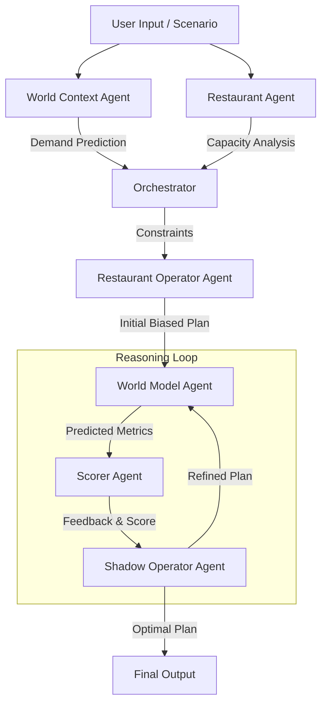

# QSR World Model: A "Noob Operator" Playground 🍔🤖

> **Status:** Prototype / Experimental  
> **Velocity:** Built in ~2 days over a holiday weekend

## 🎯 Objective: Why This Matters

The core ambition of this project is to explore the concept of a **World Model**—not for robotics or video games (where it is typically applied), but for the messy, high-pressure environment of Quick Service Restaurant (QSR) operations.

In AI research, a World Model aims to enable an agent to simulate the future ensuring they can predict consequences of actions before taking them. It relies on:
1.  **Representation Learning:** Understanding the current state.
2.  **Planning & Reasoning:** Simulating "what if" scenarios to optimize decisions.

This project is a **crude, agentic approximation** of that concept. Instead of deep reinforcement learning, we leverage **Chain-of-Thought (CoT) reasoning** and Large Language Models (LLMs) to construct a mental model of a restaurant shift. We want to see if a system of agents can "think" through a staffing plan, simulate the chaos of a Friday dinner rush, and refine its decisions just like a seasoned manager would—but in seconds, not hours.

## 🧪 The Experiment: Learning Loops & Flaws

This is as much a learning tool for the author as it is a software prototype. The domain of QSR operations is incredibly nuanced. There are inherent flaws in my own understanding of the problem space, and the agents themselves are "noob operators"—subject to hallucinations, bad assumptions, and limited context.

**The central loop we are exploring is:**
1.  **Propose:** An agent proposes a staffing plan based on a specific "Operator Priority" (e.g., cutting costs).
2.  **Simulate:** A separate "World Model" agent plays out that shift, predicting wait times, revenue, and bottlenecks.
3.  **Critique:** A "Scorer" agent evaluates the outcome against multi-objective targets (Profit vs. Satisfaction vs. Wellbeing).
4.  **Refine:** A "Shadow Operator" (the rational planner) iterates on the plan to find a global optimum that a biased human might miss.

## 🧠 Conceptual Overview

We narrowed the scope to a single critical decision: **Staffing Allocation**.

Human operators often have biases—they might be hyper-focused on **Minimizing Labor Cost** at the expense of customer service, or they might over-staff to ensure **Staff Wellbeing**, killing profitability.

This project models those biases and then attempts to correct them through **Rational Planning**. By iterating through the "World Model," the system enables **Multi-Objective Modeling**, balancing competing goals:
*   **Profit Target Score:** Efficiency and labor cost management.
*   **Guest Satisfaction Target Score:** Speed of service and order accuracy.
*   **Staff Wellbeing Target Score:** Preventing burnout and under-utilization.

### The Agentic World Model Loop

The system operates as a coordinated dance of specialized agents:

## 🔑 Key Features

### Functional
*   **Multi-Agent Orchestra:** 7+ specialized agents working in concert.
*   **Iterative Refinement:** The system doesn't just give an answer; it "thinks" and improves its answer over multiple steps.
*   **Bias Modeling:** Simulate shifts from different perspectives (e.g., "Customer First" vs. "Minimize Cost").
*   **Rich Scenarios:** Handles weather, special events (post-game rush), and day-part variations.

### Technical
*   **Agentic Framework:** Built on Google Gemini with custom prompt engineering for structured reasoning.
*   **Dynamic Discovery:** Frontend automatically scans and connects to available backends.
*   **Evaluation Engine:** Dedicated CLI tools to "grade" the agents against known ground-truth scenarios.
*   **Transparency:** Full visibility into the "Inner Monologue" of every agent via the UI.

## 📂 Project Structure

This playground consists of two main components. Please refer to their respective READMEs for setup instructions:

*   **[Backend (Python/FastAPI)](./be/qsr-be/README.md):** The brain of the operation. Hosts the agents, the orchestration logic, and the simulation engine.
*   **[Frontend (React/Vite)](./fe/qsr-fe/README.md):** The visual workspace. Provides a "canvas" for users to tweak scenarios, run the model, and visualize the iterative reasoning process.

---
*Built with ❤️ and a lot of caffeine.*
